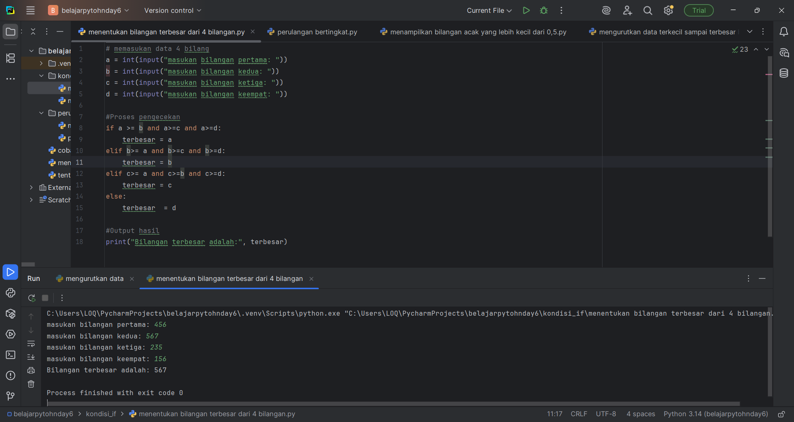

# Penjelasan Latihan 1
# Program Sederhana Menentukan Bilangan Terbesar dari 4 Bilangan

## Deskripsi Program
Program ini dibuat untuk mencari **bilangan terbesar** dari **empat bilangan yang dimasukkan oleh pengguna**.  
Melalui proses **input**, **logika percabangan**, dan **output**, program menentukan angka mana yang memiliki nilai paling besar

---

## Kode Program Lengkap
```python
# Memasukkan data 4 bilangan
a = int(input("Masukkan bilangan pertama: "))
b = int(input("Masukkan bilangan kedua: "))
c = int(input("Masukkan bilangan ketiga: "))
d = int(input("Masukkan bilangan keempat: "))

# Proses pengecekan bilangan terbesar
if a >= b and a >= c and a >= d:
    terbesar = a
elif b >= a and b >= c and b >= d:
    terbesar = b
elif c >= a and c >= b and c >= d:
    terbesar = c
else:
    terbesar = d

# Output hasil
print("Bilangan terbesar adalah:", terbesar)
```

---

## Penjelasan Setiap Bagian Kode

### 1. Bagian Input
Pada bagian ini, program meminta pengguna untuk memasukkan **empat buah bilangan bulat (integer)**.  
Fungsi `input()` digunakan untuk menerima data dari pengguna, dan `int()` digunakan untuk mengubahnya menjadi tipe data bilangan bulat.  
Empat variabel (`a`, `b`, `c`, dan `d`) masing-masing menyimpan nilai yang dimasukkan.

### 2. Bagian Logika / Proses Pengecekan
Bagian ini adalah inti dari program.

- `if` digunakan untuk mengecek apakah `a` lebih besar atau sama dengan semua bilangan lainnya.  
  Jika ya, berarti `a` adalah bilangan terbesar.  
- Jika tidak, program lanjut ke `elif` berikutnya untuk membandingkan `b`.  
- Begitu juga untuk `c`.  
- Jika semua kondisi di atas tidak terpenuhi, maka otomatis `d` adalah yang terbesar (dalam `else`).

Struktur ini memastikan bahwa **hanya satu kondisi yang benar**, sehingga hasilnya tidak tumpang tindih.
### 3. Bagian Output
Baris ini menampilkan hasil perbandingan tadi ke layar.  
Fungsi `print()` digunakan untuk menampilkan teks dan nilai variabel `terbesar`.  

---

## Bukti Run Program Latihan 1

---
# Penjelasan Latihan 2
# Program Mengurutkan Data Dari Yang Terkecil Sampai Terbesar

## Deskripsi Program
Program ini berfungsi untuk **mengurutkan sekumpulan bilangan** yang dimasukkan oleh pengguna.  
Jumlah data yang dapat dimasukkan minimal **3 bilangan**, dan hasilnya akan ditampilkan secara **menyamping (horizontal)** setelah diurutkan dari **kecil ke besar**.

---

## Kode Program Lengkap
```python
print("=== Program Mengurutkan Data ===")
jumlah_data = int(input("Masukkan jumlah data (minimal 3): "))

if jumlah_data < 3:
    print("Jumlah data harus minimal 3!")
else:
    data = []
    for i in range(jumlah_data):
        nilai = int(input(f"Masukkan data ke-{i+1}: "))
        data.append(nilai)

    data.sort()

    print("\nUrutan bilangan:")
    for d in data:
        print(d, end=" ")  # tampil menyamping
    print()  # biar barisnya rapi setelah selesai
```

---
## Penjelasan Setiap Bagian Kode
### 1. Judul Program
```python
print("=== Program Mengurutkan Data ===")
```
Baris ini menampilkan judul sebagai penanda bahwa program sedang berjalan.
### 2. Input Jumlah Data
```python
jumlah_data = int(input("Masukkan jumlah data (minimal 3): "))
```
Program meminta pengguna untuk memasukkan **jumlah data** yang ingin diurutkan.  
Nilai ini kemudian diubah menjadi tipe **integer** agar bisa digunakan dalam perulangan.
### 3. Validasi Minimal Data
```python
if jumlah_data < 3:
    print("Jumlah data harus minimal 3!")
```
Jika jumlah data yang dimasukkan kurang dari 3, program langsung memberikan peringatan dan **tidak melanjutkan proses**.
### 4. Proses Input Nilai
```python
for i in range(jumlah_data):
    nilai = int(input(f"Masukkan data ke-{i+1}: "))
    data.append(nilai)
```
Bagian ini menggunakan **perulangan `for`** untuk meminta pengguna memasukkan data sebanyak jumlah yang sudah ditentukan sebelumnya.  
Setiap nilai akan disimpan dalam **list `data`**.
### 5. Pengurutan Data
```python
data.sort()
```
Fungsi `sort()` digunakan untuk **mengurutkan isi list** dari nilai terkecil ke terbesar secara otomatis.

---

### 6. Menampilkan Hasil Urutan
```python
for d in data:
    print(d, end=" ")  # tampil menyamping
print()
```
Hasil bilangan yang telah diurutkan akan ditampilkan **menyamping dalam satu baris** agar lebih mudah dibaca.  
Parameter `end=" "` pada fungsi `print()` membuat hasilnya tidak pindah baris setelah setiap angka.

---

## Bukti Run Program Latihan 2


