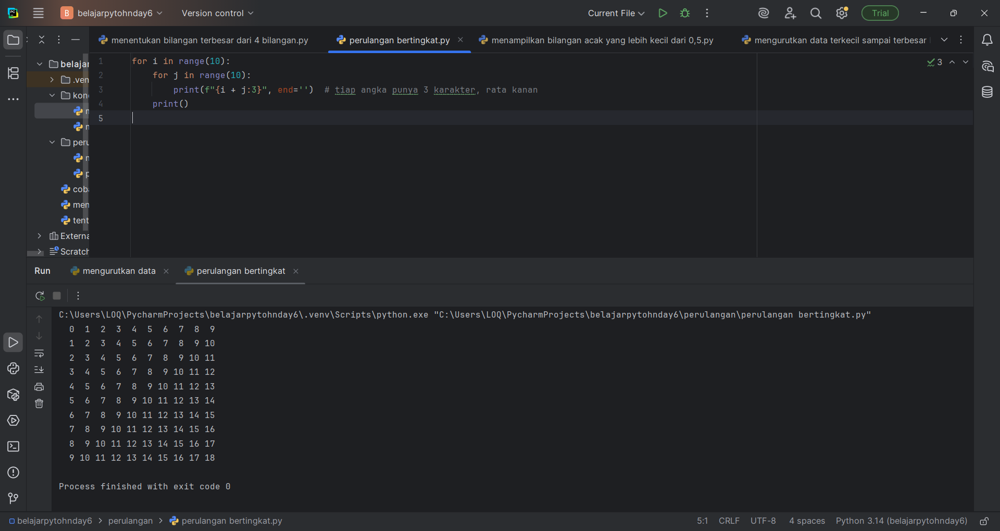

# Penjelasan Latihan 1
# Program Perulangan Bersarang (NESTED LOOP)

## Deskripsi Program
Program ini menggunakan dua perulangan bersarang (nested loop) untuk menampilkan hasil penjumlahan antara dua variabel `i` dan `j` dalam bentuk tabel.  
Setiap nilai hasil penjumlahan ditampilkan dalam format 3 karakter lebar agar tampilan lebih rapi dan sejajar ke kanan.

---

## Kode Program Lengkap
```python
for i in range(10):
    for j in range(10):
        print(f"{i + j:3}", end='')  # tiap angka punya 3 karakter, rata kanan
    print()
```

## Penjelasan:
1. `for i in range(10):`  
   - Membuat perulangan dengan variabel `i` dari 0 sampai 9.
2. `for j in range(10):`  
   - Di dalam setiap iterasi `i`, dilakukan perulangan `j` dari 0 sampai 9.
3. `print(f"{i + j:3}", end='')`  
   - Menampilkan hasil penjumlahan `i + j`.
   - `:3` artinya setiap angka akan dicetak dalam **lebar 3 karakter** dan **rata kanan**.
   - `end=''` digunakan agar tidak pindah baris setelah mencetak angka (agar hasil sejajar ke samping).
4. `print()`  
   - Digunakan untuk pindah ke baris baru setelah satu baris perulangan `j` selesai.

---

## Bukti Run Program Latihan 1


# Penjelasan 2
# Program mencari bilangan random yang kurang dari 0,5

## 📘 Deskripsi
Program ini menggunakan modul `random` untuk menghasilkan angka acak antara 0 dan 1.  
Program akan menampilkan sejumlah nilai acak yang kurang dari 0.5, sebanyak `n` kali sesuai input pengguna.

---

## Kode Program
```python
import random

n = int(input("Masukkan jumlah n: "))

jumlah = 0

while jumlah < n:
    angka = random.random()
    if angka < 0.5:
        print(angka)
        jumlah += 1
```

### Penjelasan

1. `import random`  
   - Mengimpor modul `random` agar bisa menggunakan fungsi penghasil angka acak.

2. `n = int(input("Masukkan jumlah n: "))`  
   - Meminta pengguna memasukkan jumlah angka acak yang ingin ditampilkan.

3. `jumlah = 0`  
   - Variabel penghitung untuk memastikan program hanya mencetak angka kurang dari 0.5 sebanyak `n` kali.

4. `while jumlah < n:`  
   - Perulangan akan terus berjalan selama jumlah angka yang dicetak masih kurang dari `n`.

5. `angka = random.random()`  
   - Menghasilkan angka acak antara 0.0 hingga 1.0.

6. `if angka < 0.5:`  
   - Hanya angka acak yang **kurang dari 0.5** yang akan dicetak ke layar.

7. `print(angka)` dan `jumlah += 1`  
   - Menampilkan angka ke layar dan menambah penghitung `jumlah` sebanyak 1.

---

## Bukti Run Program Latihan 2

